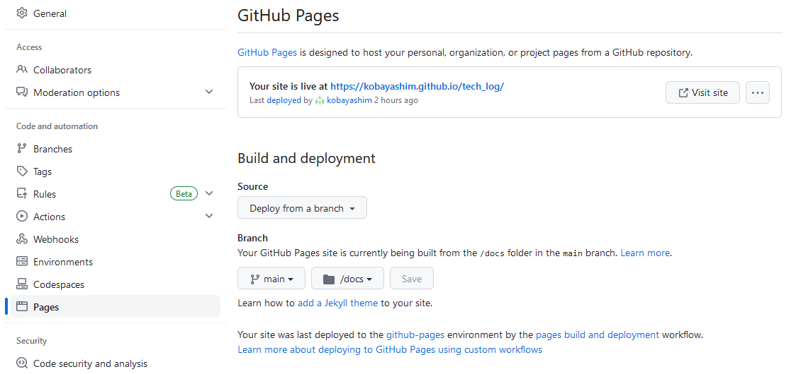

# Sphinx

## 前提

ここでは Windows 上での使用を前提としている。macOS や Linux の場合は適宜読み替えを実施すること。  
また作成した文章は Github Pages での公開を前提としている。

## Sphinxの導入

### Python3のインストール

Python3 が導入済みであることを前提としている。  
導入済みかはターミナルから

``` powershell
[PowerShell on Windows]

# pythonのバージョン確認
> python -V
```

を実施し、3系のバージョン番号が返ってくればインストール済みとなる。  

未インストールの場合は [公式サイト](https://www.python.org/downloads/) からインストーラーを取得し、実行する。  
複数プロジェクト等により複数のバージョンが混在する場合は [こちらのサイト](https://python-beginner.blog/multiversion/) を参照して切り替える。

### プロジェクトフォルダに移動

Github Pages での公開を前提としているため、管理するリポジトリからあらかじめcloneをしておく。  
以下の手順ではcloneしたローカルリポジトリ直下をカレントディレクトリとする。

### Sphinxのインストール

``` powershell
[PowerShell on Windows]

# Sphinxのインストール
> pip install sphinx
```

### クイックスタート

``` powershell
[PowerShell on Windows]

# クイックスタートの実施
> sphinx-quickstart
```

を実施し、プロジェクトを初期化する。  
途中の選択肢は以下の選択する。

```
Separate source and build directories (y/n) [n]: y
Project name: プロジェクトの名称
Author name(s): 作者名
Project release []: 0.0.1 (任意でよい)
Project language [en]: jp
```

### テーマの変更

ここではデフォルトのテーマから「Cloud」テーマに変更する手順を記す。  
テーマは個人の好みであるため、変更しなくてもよいし別のテーマとしてもよい。

#### テーマのインストール

``` powershell
[PowerShell on Windows]

# テーマのインストール
> pip install cloud-sptheme
```

#### copy.pyの書き換え

./souce/copy.py を以下の様に書き換える

``` diff
- html_theme = 'alabaster'
+ html_theme = 'cloud' 
```

### Markdownの有効化

ReSTだけではなく、Markdownでも記述可能とする。

#### プラグインインストール

``` powershell
[PowerShell on Windows]

# プラグインのインストール
> pip install myst_parser
```

#### copy.pyの書き換え

./souce/copy.py を以下の様に書き換える

``` diff
- extensions = []
+ extensions = ['myst_parser']
+
+ source_suffix = {
+     '.rst': 'restructuredtext',
+     '.md': 'markdown',
+ }
```

### Github Pages対応

Github Pagesに対応するため、HTMLの出力先を ./build/html から ./docs に変更し、CSS等のファイルのdocs以下のフォルダに配置するように設定の変更を実施する。

#### copy.pyの書き換え

./souce/copy.py を以下の様に書き換える

``` diff
- extensions = ['myst_parser']
+ extensions = ['myst_parser', 'sphinx.ext.githubpages']
```

#### make.batの書き換え

./make.bat を以下の様に書き換える

``` diff
  if "%1" == "" goto help
+ if "%1" == "html" goto html

  %SPHINXBUILD% -M %1 %SOURCEDIR% %BUILDDIR% %SPHINXOPTS% %O%
  goto end

+ :html
+ %SPHINXBUILD% -b html %SOURCEDIR% "docs" %SPHINXOPTS% %O%
+ goto end
+
  :help
  %SPHINXBUILD% -M help %SOURCEDIR% %BUILDDIR% %SPHINXOPTS% %O%
```

macOSやLinuxの場合は ./Makefile に同様の処理を加える。

#### Githubの設定変更

Githubのプロジェクトページに行き、「Setting」->「Pages」と遷移し、  
Source を「Deploy from a branch」に、  
Branch を「main」「docs」にそれぞれ変更する。





### 自動ビルド対応

手動でのビルドだけではなく、自動でのビルドにも対応可能とする。

#### プラグインインストール

``` powershell
[PowerShell on Windows]

# プラグインのインストール
> pip install sphinx-autobuild
```

#### make.batの書き換え

./make.bat を以下の様に書き換える

``` diff
  if "%1" == "" goto help
  if "%1" == "html" goto html
+ if "%1" == "live" goto live

  %SPHINXBUILD% -M %1 %SOURCEDIR% %BUILDDIR% %SPHINXOPTS% %O%
  goto end

  :html
  %SPHINXBUILD% -b html %SOURCEDIR% "docs" %SPHINXOPTS% %O%
  goto end

+ :live
+ sphinx-autobuild source docs
+ goto end
+
  :help
  %SPHINXBUILD% -M help %SOURCEDIR% %BUILDDIR% %SPHINXOPTS% %O%
```

macOSやLinuxの場合は ./Makefile に同様の処理を加える。

## ビルド

ローカルリポジトリ直下で以下を実行する。

### 手動ビルド

``` powershell
[PowerShell on Windows]

# HTMLの生成
>  .\make.bat html
```

./docs 以下にHTMLが生成される

### 自動ビルド

``` powershell
[PowerShell on Windows]

# HTMLの生成
>  .\make.bat live
```

./docs 以下にHTMLが生成され、かつ変更があるたびに自動的にビルドが実行される。  
またデフォルト設定では

[http://127.0.0.1:8000/](http://127.0.0.1:8000/) にてビルドされたHTMLを参照することができる。

## 参考

[Sphinx](https://www.sphinx-doc.org/ja/master/index.html)  
[sphinxでドキュメント作成からWeb公開までをやってみた](https://qiita.com/kinpira/items/505bccacb2fba89c0ff0)  
[SphinxとGitHub Pagesで技術ノートを公開しよう！](https://qiita.com/tutuz/items/88a32d94d700b33dc3ea)  
[sphinx-autobuildで再ビルド、ブラウザの再リロードの手間を省いてSphinx文書をサクサク作成](https://qiita.com/mikanbako/items/28a3fc5d1da42939f941)  